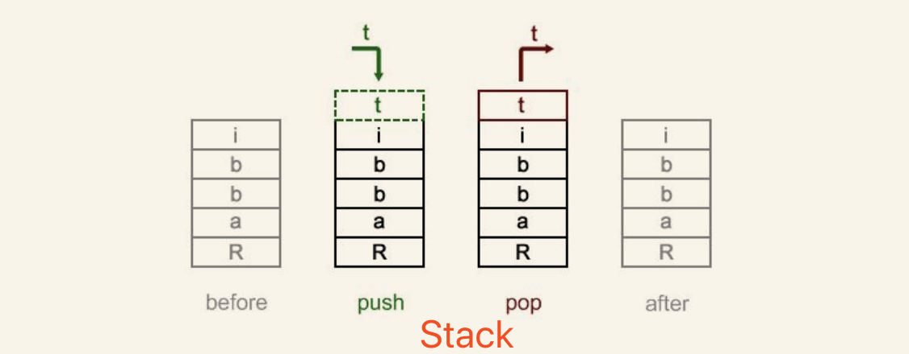

# 数据结构简介
### 结构体

> 通常当我们需要将数据分组存储一系列数据的时候,我们可以用到 **struct**.比如存储学生的信息数据的时候,我们需要将学生的姓名,地址,电话号码,邮件等信息存储的时候这时候使用 struct 就很用表示这组数据.

###数组

> 在 PHP 中数组通常被认为是有序的 *map*.我们可用存储很多数据在一个数组中.多维数组在编程语言中也很常用.在 PHP 中,你可以定义一个动态的数组而不需要定义数组的长度

### 单项链表

> **链表**是一种线性数据结构,数据元之间通过指针相互连接,在后续的介绍中会看到,链表通常包含着有序集

### 双向链表
> 双向链表是一种特殊的列表,同时存储的上线节点的地址,所以不仅能像单向链表一样向后遍历,还能向前遍历

### 堆 (Heap)
> 堆是一种特殊的基于树的一种数据结构.

### 栈 (Stack)
> **Stack**是一种先进后出(LIFO)的线性数据结构,支持出栈入栈的基本操作

### 队列 (Queue)
> 队列是一种先进先出的数据结构.队列允许出队和入队两种基本操作

### 集合 (Set)
> 集合是一种抽象数据结构,数据无序存储并且不能重复,集合通常可以用来检测数据是否存在其中.

### Map
> **Map**是一个键值对集合,Map 中的所有键都是唯一的.我们可以认为 *map*是所有键都是唯一的关系型数组.我们可以通过键名更新,查找或者删除一组键值对.另外, PHP 数组就是对有序*map*的实现

### 树 (Tree)
> 树是使用最为广泛的非线性数据结构.

### 图(Gragh)

