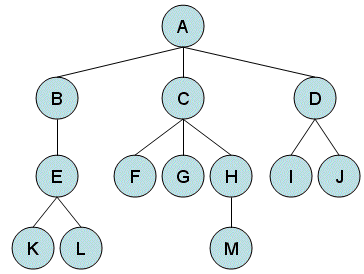
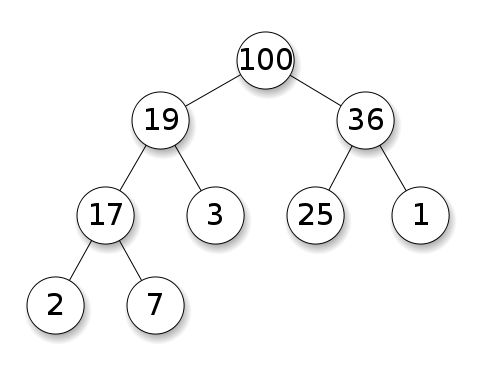
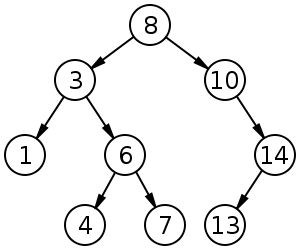
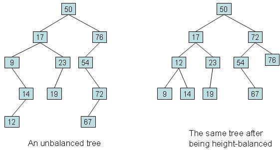

# 树的实现
> 前面写那么多文章都是是线性数据结构的探索.无论数组,链表,栈,队列都是线性数据结构
我们看到了线性数据结构的大多数时候的增删的时间复杂度都是 *O(1)*.唯一例外的就是 PHP 数组,事实上是对 hash 表的实现.为了解决这个问题我们可以使用具有等级的数据结构来取代线性数据结构.这种数据结构能解决很多线性数据结构无法解决的问题.树是对链表在分级层次上的实现.


### 树的定义和特性
树由一组顶点（vertex） 以及联接与其间的若干条边（ edge）组成.树不能成环形,其边仅仅存在于相邻节点间.同一个父亲节点下的孩子节点不能相互连接.,其他关于树的特定和特性这里不再赘述可以查看维基百科或者任何一本数据结构的书.


### 使用 PHP 实现树
我想通过查阅树的定义和特性的资料,你已经了解了很多关于树的知识,下面我们通过 PHP 来实现树.

```php
class Tree
{
    public $root = NULL;

    public function __construct(TreeNode $node)
    {
        $this->root = $node;
    }

    /**
     * 树的遍历
     * @param TreeNode $node
     * @param int $level
     */
    public function traverse(TreeNode $node, int $level = 0)
    {
        if ($node) {
            echo str_repeat("-", $level);
            echo $node->data . "\n";

            foreach ($node->children as $childNode) {
                $this->traverse($childNode, $level + 1);
            }
        }
    }
}
```

测试及输出

```php
$ceo = new TreeNode("CEO");
$tree = new Tree($ceo);

$cto = new TreeNode("CTO");
$cfo = new TreeNode("CFO");
$cmo = new TreeNode("CMO");
$coo = new TreeNode("COO");

$ceo->addChildren($cto);
$ceo->addChildren($cfo);
$ceo->addChildren($cmo);
$ceo->addChildren($coo);

$seniorArchitect = new TreeNode("Senior Architect");
$softwareEngineer = new TreeNode("Software Engineer");
$userInterfaceDesigner = new TreeNode("User Interface Designer");
$qualityAssuranceEngineer = new TreeNode("Quality Assurance Engineer");

$cto->addChildren($seniorArchitect);
$seniorArchitect->addChildren($softwareEngineer);
$cto->addChildren($qualityAssuranceEngineer);
$cto->addChildren($userInterfaceDesigner);

$tree->traverse($tree->root);

// 输出
CEO
-CTO
--Senior Architect
---Software Engineer
--Quality Assurance Engineer
--User Interface Designer
-CFO
-CMO
-COO
```

### 二叉树 (Binary tree)
二叉树是树类型中基础的类型,每个节点最多有2个孩子节点.孩子节点被分为左右孩子节点.




### 二叉搜索树(BST)
BST 是二叉树中一种特殊的类型.所有的节点有序存储.所有的节点必须比左孩子大,比右孩子小.由于这个特殊性, BST 可以用做构建元素的搜索算法.


### 平衡二叉搜索树
二叉搜索树接口运行时间，均线性正比于二叉搜索树的高度。而在最坏情况下，二叉搜索树可能彻底地退化为列表， 此时的查找效率 甚至会降至O(n)，线性正比于数据集的规模。因此，若不能有效地控制树高， 则就实际的性能而言，较之此前的向量和列表，二叉搜索树将无法体现出明显优势。

平衡二叉搜索树是一种特殊的二叉搜索树通过自动调整保持书稿和叶子的数量尽可能的少.例如下图,左边是普通二叉搜索树,右图是平衡二叉搜索树




平衡二叉搜索树的搜索速度高于常规的二叉树, 有如下几种平衡二叉搜索树:
- AA 树
- AVL 树
- 红黑树
- 替罪羊树
- 分裂树 (Splay tree)
- 2-3 tree
- Treap

### 二叉树的 PHP 实现
首先我们先创建一个普通的二叉树,从定义出发,二叉树有一个节点值和2个孩子.

```php
class BinaryNode {

    public $data;
    public $leftChild;
    public $rightChild;

    public function __construct(string $data = NULL) {
        $this->data = $data;
        $this->leftChild = NULL;
        $this->rightChild = NULL;
    }

    public function addChildren(BinaryNode $left, BinaryNode $right) {
        $this->leftChild = $left;
        $this->rightChild = $right;
    }
}
```

```php
class BinaryTree
{
    public $root = NULL;

    public function __construct(BinaryNode $node)
    {
        $this->root = $node;
    }

    public function traverse(BinaryNode $node, int $level = 0)
    {
        if ($node) {
            echo str_repeat("-", $level);
            echo $node->data . "\n";

            if ($node->leftChild)
                $this->traverse($node->leftChild, $level + 1);

            if ($node->rightChild)
                $this->traverse($node->rightChild, $level + 1);
        }
    }
}
```

测试与输出

```php

$final = new BinaryNode("Final");

$tree = new BinaryTree($final);

$semiFinal1 = new BinaryNode("Semi Final 1");
$semiFinal2 = new BinaryNode("Semi Final 2");
$quarterFinal1 = new BinaryNode("Quarter Final 1");
$quarterFinal2 = new BinaryNode("Quarter Final 2");
$quarterFinal3 = new BinaryNode("Quarter Final 3");
$quarterFinal4 = new BinaryNode("Quarter Final 4");

$semiFinal1->addChildren($quarterFinal1, $quarterFinal2);
$semiFinal2->addChildren($quarterFinal3, $quarterFinal4);

$final->addChildren($semiFinal1, $semiFinal2);

$tree->traverse($tree->root);

Final
-Semi Final 1
--Quarter Final 1
--Quarter Final 2
-Semi Final 2
--Quarter Final 3
--Quarter Final 4
```


### 对二叉搜索的理解
BST 具有顺序性,左孩子不大于节点值,右边点不小于节点值.所以,无论我们什么时候搜索一个值得时候,总是搜索左右孩子节点,因为有序性,我们只需要搜索一边,然后进行迭代搜索.由于这一特性,搜索将会特别的快,算法复杂度为 *O(log n)*.不像二叉树,对于 BST 在没有重构 BST 的基础上,我们不能添加或者移除任意一个节点.

#### 插入新节点
当我们为 BST 插入一个节点的时候,应当考虑以下步骤:
- 新建一个节点作为叶子节点
- 从根节点开始设置为当前节点.
- 如果节点为空,让新节点作为根节点
- 检查左节点的值是否比当前节点小.
- 如果小检查左节点,并设置左节点为当前节点
- 如果大检查右节点.并设置为当前节点.
- 重复步骤三,直到所有的节点都被访问,并且插入新节点

#### 节点的搜索

#### 查找最小值

#### 查找最大值

#### 节点的删除

#### 二叉搜索树的构建

```php

class Node
{
    public $data;
    public $left;
    public $right;

    function __construct(int $data = NULL)
    {
        $this->data = $data;
        $this->left = NULL;
        $this->right = NULL;
    }

    public function min()
    {
        $node = $this;

        while ($node->left) {
            $node = $node->left;
        }

        return $node;
    }

    public function max()
    {
        $node = $this;

        while ($node->right) {
            $node = $node->right;
        }

        return $node;
    }

    public function successor()
    {
        $node = $this;
        if ($node->right)
            return $node->right->min();
        else
            return NULL;
    }

    public function predecessor()
    {
        $node = $this;
        if ($node->left)
            return $node->left->max();
        else
            return NULL;
    }

}
```

```php

class SortBinaryTree
{
    public $root = NULL;

    function __construct(int $data)
    {
        $this->root = new Node($data);
    }

    public function isEmpty()
    {
        return $this->root === NULL;
    }
    

    /**
     * 插入
     * @param int $data
     * @return Node|null
     */
    public function insert(int $data)
    {
        if ($this->isEmpty()) {
            $node = new Node($data);
            $this->root = $node;
            return $node;
        }

        $node = $this->root;
        while ($node) {
            if ($data > $node->data) {
                if ($node->right) {
                    $node = $node->right;
                } else {
                    $node->right = new Node($data);
                    $node = $node->right;
                    break;
                }
            } elseif ($data < $node->data) {
                if ($node->left) {
                    $node = $node->left;
                } else {
                    $node->left = new Node($data);
                    $node = $node->left;
                    break;
                }
            } else {
                break;
            }
        }
        return $node;
    }

    /**
     * 遍历
     * @param Node $node
     */
    public function traverse(Node $node) {
        if ($node) {
            if ($node->left)
                $this->traverse($node->left);
            echo $node->data ."<br>";
            if ($node->right)
                $this->traverse($node->right);
        }
    }

    /**
     * 单节点的搜索
     * @param int $data
     * @return bool|Node|null
     */
    public function search(int $data)
    {
        if ($this->isEmpty())
            return false;

        $node = $this->root;
        while ($node) {
            if ($data > $node->data) {
                $node = $node->right;
            } elseif ($data < $node->data) {
                $node = $node->left;
            } else {
                break;
            }
        }
        return $node;
    }
```

测试及输出

```php


$tree = new SortBinaryTree(10);

$tree->insert(12);
$tree->insert(6);
$tree->insert(3);
$tree->insert(8);
$tree->insert(15);
$tree->insert(13);
$tree->insert(36);

$tree->traverse($tree->root);

3
6
8
10
12
13
15
36
```


