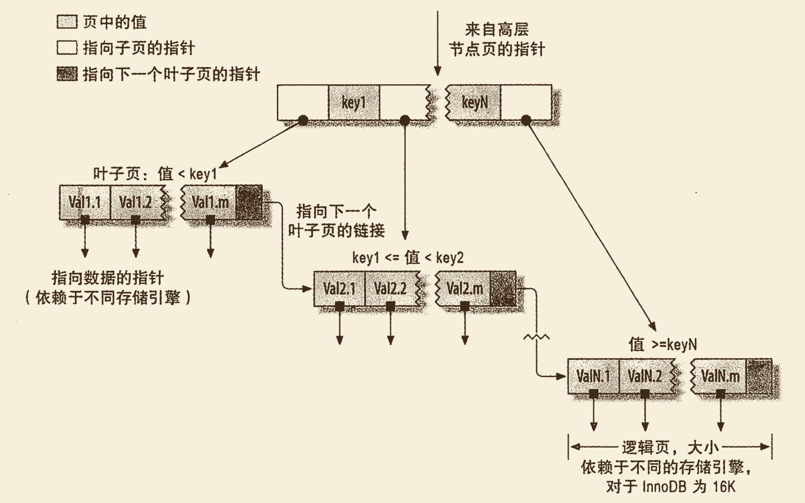

# 创建高性能的索引 1
## 索引基础

```sql
SELECT first_name FROM sakila.actor WHERE actor_id = 5;
```
如果 *actor_id* 列上有索引,这 MySQL 将使用该索引找到 *actor_id* 为5的列,也就是说 MySQL 会在索引上按值进行查找,然后返回所有包含改值得数据行.

索引可以包含一个或者多个列的值.如果索引包含多个列,列的顺序也很重要,因为 MySQL 只能高效的使用索引的最左前缀列.创建一个包含两个列的索引和创建两个只包含一列的索引是大不相同的

> **如果使用的是 ORM, 是否还需要关心索引?**
> 仍然需要


### 索引的类型
索引有很多类型, 现在MySQL中,索引是在存储引擎层而不是服务器层实现的.所以不同的存储引擎有不同的索引类型

### B-Tree 索引
存储引擎以不同的方式使用 B-Tree 索引,性能也各有不同,各有优劣.

MyISAM 使用前缀压缩技术使得索引更小,但是 InnoDB 则按照原数据格式进行存储.在 InnoDB 中使用 B+Tree.MyISAM索引通过数据的物理位置引用被索引的行,而InnoDB 则根据主键引用被索引的行.

B-Tree意味着所有的值都是按照顺序存储的,并且每一个叶子页到根的距离相同.下图表示了B-Tree索引的抽象表示,大致反映了 InnoDB 索引是如何工作的.


B-Tree索引能加快访问数据的速度,因为存储引擎不再需要进行全表扫描来获取需要的数据,取而代之是从索引的根节点进行搜索.关于 B+Tree 的数据结构介绍,可以参见我的数据结构相关的文章.

请注意,索引对多个值进行排序的依据是 CREATE TABLE 语句中定义索引时列的顺序.

可以使用 B-Tree 索引的查询类型. B-Tree 索引适合全键值,键值范围或键前缀查找.其中键前缀查找只适合于根据最左前缀的查找. B-Tree 对如下类型的查询有效:

##### **全值匹配**


##### **匹配最左前列**

##### **匹配列前缀**

##### **匹配范围值**

##### **精确匹配某一列并范围匹配另外一列**

##### **只访问索引的查询**

因为索引书中的节点是有序的,所以除了按值查找之外,索引还可以用于查询中的 ORDER BY 操作.一般来说如果 B-Tree 可以按照某种方式查找到值,那么也可以按照这种方式用于排序.

**下面是一些关于 B-Tree 索引的限制:**

- 如果不是按照索引的最左列开始查找,则无法使用索引.
- 不能跳过索引中的列
- 如果查询中有某个列的范围查询,则其右边所有的列都无法使用索引优化查找,比如使用 LIKE. 如果范围查询劣质的数量有限,那么可以通过使用多个等于条件来替代范围条件.

综上所述,**索引列的顺序**是多的重要.索引再优化性能的时候,需要根据不用的也无需求来设计*索引列的顺序*

####**Cardinality**

- **什么是Cardinality?** 通过 SHOW INDEX 来查看数据表的 *Cardinality*项,表示索引中以为只记录数量的预估值.当 Cardinality/n_rows_in_table 应尽可能的等于1,否则就要考虑是否需要索引当前列.
- **Cardinality的统计**  采用采样的方法:  1.表中1/16的数据发生了变化;2.stat_modified_counter > 2000000000

#### B+ 树索引的使用
##### 在不同应用中使用
- OLTP 应用中查询操作中只从数据库取一小部分数据,这是建立 B+树索引很有意义
- OLAP 应用中需要访问大量的数据,如果 OLAP 中的复杂查询涉及多张表之间的联结操作,这是添加索引有意义,如果联结操作使用 HASH Join, 那么索引可能又变得没有必要.

##### 联合索引
&emsp;&emsp;联合索引需要注意的事项在上面 B-Tree 都说介绍的很详细了.

##### 覆盖索引

##### 优化器选择不使用索引的情况
&emsp;&emsp;在某些情况下发现优化器并没有使用索引去查找数据,而是进行了全表扫描.这种情况多发生于范围查找,Join 等操作.例如:

```sql
mysql> explain SELECT * FROM tb_cinema WHERE cinema_id > 100 and cinema_id < 120;
+----+-------------+-----------+------------+-------+---------------+-----------+---------+------+------+----------+-----------------------+
| id | select_type | table     | partitions | type  | possible_keys | key       | key_len | ref  | rows | filtered | Extra                 |
+----+-------------+-----------+------------+-------+---------------+-----------+---------+------+------+----------+-----------------------+
|  1 | SIMPLE      | tb_cinema | NULL       | range | cinema_id     | cinema_id | 4       | NULL |    5 |   100.00 | Using index condition |
+----+-------------+-----------+------------+-------+---------------+-----------+---------+------+------+----------+-----------------------+
1 row in set, 1 warning (0.00 sec)

mysql> explain SELECT * FROM tb_cinema WHERE cinema_id > 100 and cinema_id < 46349;
+----+-------------+-----------+------------+------+---------------+------+---------+------+------+----------+-------------+
| id | select_type | table     | partitions | type | possible_keys | key  | key_len | ref  | rows | filtered | Extra       |
+----+-------------+-----------+------------+------+---------------+------+---------+------+------+----------+-------------+
|  1 | SIMPLE      | tb_cinema | NULL       | ALL  | cinema_id     | NULL | NULL    | NULL | 9014 |    50.00 | Using where |
+----+-------------+-----------+------------+------+---------------+------+---------+------+------+----------+-------------+
1 row in set, 1 warning (0.01 sec)
```
通过上面的例子可以看出,如果要求访问的数据量很小那么优化器会选择使用辅助索引,但是当访问的数据量占整个表中数据的很大一部分时(超过20%),优化器会选择通过聚集索引来查数据.如果用户使用的是固态硬盘同时确保使用辅助索引能带来更好的性能,那么使用关键字 FORCE INDEX 来强制使用某个索引:
      
```sql
mysql> explain SELECT * FROM tb_cinema FORCE INDEX(cinema_id) WHERE cinema_id > 100 and cinema_id < 46349;
+----+-------------+-----------+------------+-------+---------------+-----------+---------+------+------+----------+-----------------------+
| id | select_type | table     | partitions | type  | possible_keys | key       | key_len | ref  | rows | filtered | Extra                 |
+----+-------------+-----------+------------+-------+---------------+-----------+---------+------+------+----------+-----------------------+
|  1 | SIMPLE      | tb_cinema | NULL       | range | cinema_id     | cinema_id | 4       | NULL | 4507 |   100.00 | Using index condition |
+----+-------------+-----------+------------+-------+---------------+-----------+---------+------+------+----------+-----------------------+
1 row in set, 1 warning (0.01 sec)
```

##### INDEX HINT (索引提示)
一下两种情况使用到索引提示:

- MySQL 错误的选择了某个索引,这种情况非常少.
- 某个 SQL 语句可以选择的索引非常多,这时优化器选择执计划时间的开销可能会大于 SQL 语句本身.这时需要通过INDEX HINT来强制使用优化器不进行各个执行路径的成本分析,直接执行选择指定的索引来完成查询


### 哈希索引
MySQL 中只有 Memory 引擎显式支持哈希索引.这里不多介绍

### 空间索引
MyISAM 表支持空间索引,可以用作地理数据存储.和 B-Tree 不一样,这类索引无序前缀查询.MySQL 对 GIS 支持并不完善, PostgreSQL支持的比较好.

### 全文索引
全文索引是一种特殊类型的索引,它查找的事文本中的关键词,而不是直接比较索引中的值.全文索引和其他几类索引的匹配方式完全不一样.全文索引更类似于搜索引擎做的事情,而不是简单的 WHERE 条件匹配.以后的文章会有详细介绍更多关于全文索引的细节.


## 索引的优点及使用Tips
索引可以让服务器更快速的定位到表的指定位置.但这不是索引的唯一作用.

最常见的 B-Tree 索引,按照顺序存储数据,所以 MySQL 可以用来做 ORDER BY 和 GROUP BY 操作.因为数据是有序的,所以 B-Tree 也就会将相关的列值都存储到一起.以下总结索引的三个优点:

- 索引大大减少了服务器需要扫描的数据量
- 索引可以帮助服务器避免排序如临时表.
- 索引可以将随机 I/O 变为顺序 I/O.

同时,对于非常小的表,大部分情况下简单的全表扫描更高效.对于中到大型的表,索引就非常的有效.但是**对于特别大的表**,建立和使用索引的代价将随之增长.这种情况下需要一种技术可以直接区分出查询需要的一组数据,而不是一条一条的记录的匹配.例如可以使用分区技术.**如果表的数量特别多**,可以建立一个元数据信息表,用来查询需要用到的某些特性.例如执行那些需要聚合多个表的数据的查询,则需要记录"哪个用户的信息存储在哪个表中"的元数据,这样在查询时就可以直接忽略那些不包含指定和用户信息.对于大型系统(TB 级别的数据),只是一个常用的技巧,使用**块级别元数据技术**来替代索引.


